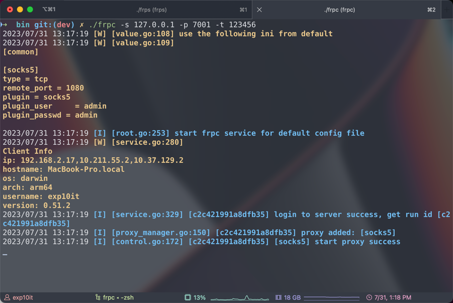
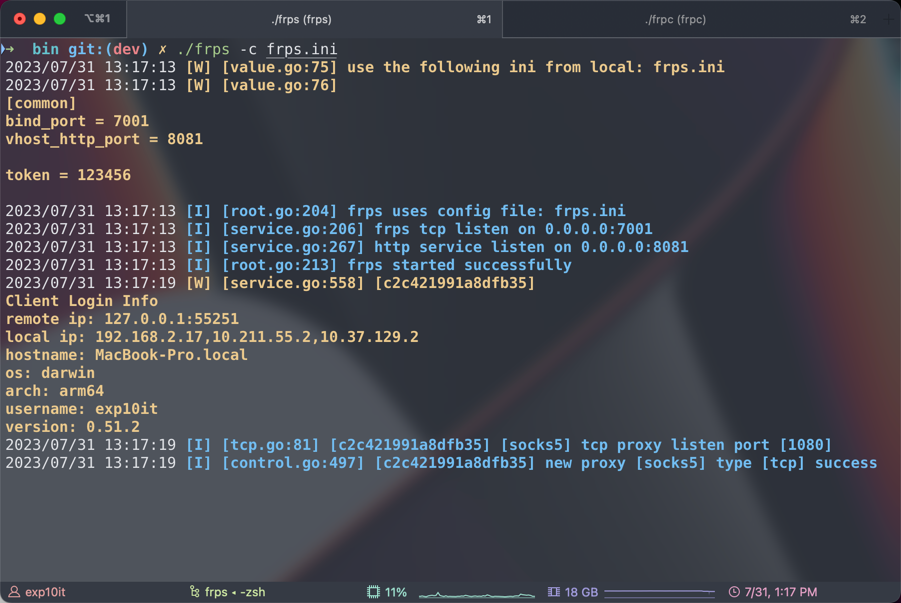

# frp

基于原版 [fatedier/frp](https://github.com/fatedier/frp) `v0.51.2` 版本二开, 添加了一些小功能

## Features

无配置文件加载

(默认开启 socks5 代理)

```shell
# 连接 127.0.0.1:7000
./frpc -s 127.0.0.1

# 连接 127.0.0.1:7001
./frpc -s 127.0.0.1 -p 7001

# token 身份验证
./frpc -s 127.0.0.1 -p 7001 -t 123456
```

从远程 url 加载配置文件

```shell
./frpc -c http://example.com/frpc.ini
```

本地配置文件自删除

```shell
./frpc -c frpc.ini --remove
```

增加详细输出





## Todo

- [x] 无配置文件/远程加载配置文件
- [x] 配置文件自删除
- [x] 增加详细输出
- [ ] Bot 推送
- [ ] 服务端 IP 加密
- [ ] 静态特征修改
- [ ] 流量特征修改
- [ ] 想到了再写