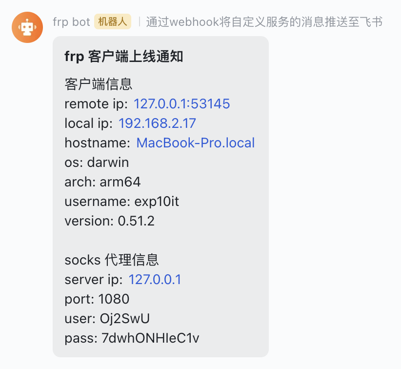

# frp

基于原版 [fatedier/frp](https://github.com/fatedier/frp) `v0.51.2` 版本二开, 添加了一些小功能

## Features

无配置文件加载

(默认开启 socks5 代理)

```shell
# 连接 127.0.0.1:7000
./frpc -s 127.0.0.1

# 连接 127.0.0.1:7001
./frpc -s 127.0.0.1 -p 7001

# token 身份验证
./frpc -s 127.0.0.1 -p 7001 -t 123456

# socks5 代理随机生成账号密码
./frpc -s 127.0.0.1 -p 7001 -t 123456 --auth
```

从远程 url 加载配置文件

```shell
./frpc -c http://example.com/frpc.ini
```

本地配置文件自删除

```shell
./frpc -c frpc.ini --remove
```

增加客户端信息输出


Bot 推送 (目前仅支持飞书)

frps.ini 配置如下内容

```ini
server_ip = 127.0.0.1 # frps 服务器 ip (仅作为显示)

push_enable = true # 是否启用 bot 推送
push_bot = feishu # bot 类型
push_token = <token> # bot token
```

当配置了 socks 代理并且 tag 名为 `socks5` 时, frps 命令行和 Bot 会显示 socks 代理的相关信息



## Todo

- [x] 无配置文件/远程加载配置文件
- [x] 配置文件自删除
- [x] 增加客户端信息输出
- [x] Bot 推送
- [x] 随机化 sock5 代理账号密码
- [ ] 随机化 socks5 代理端口
- [ ] 服务端 IP 加密
- [ ] 配置文件加密
- [ ] 静态特征修改
- [ ] 流量特征修改
- [ ] 想到了再写